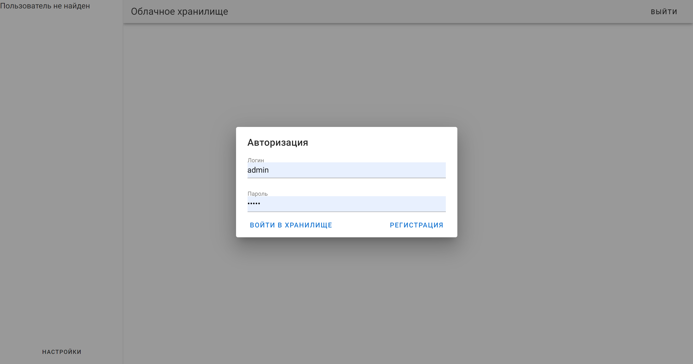
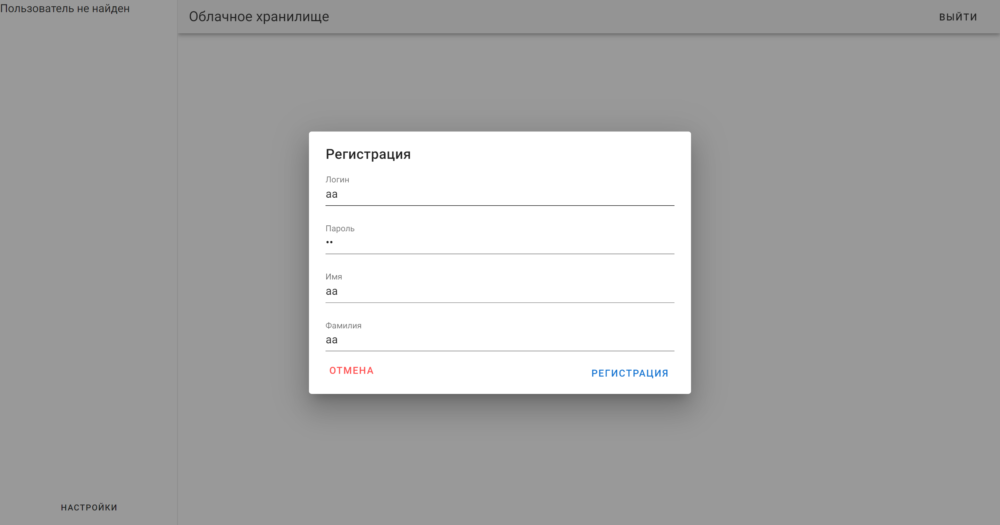
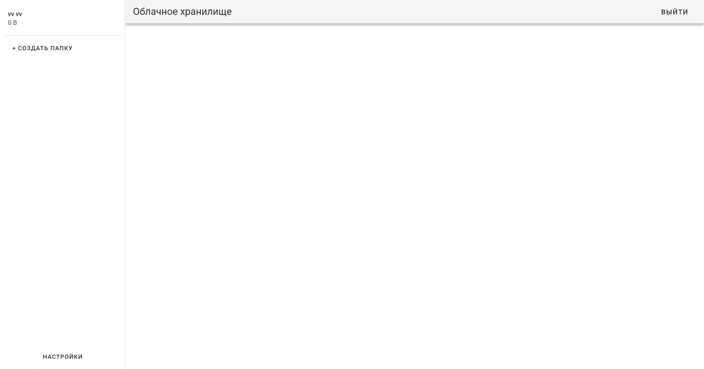
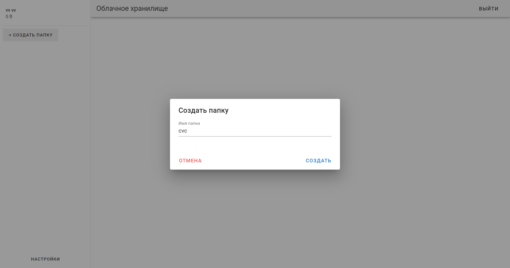
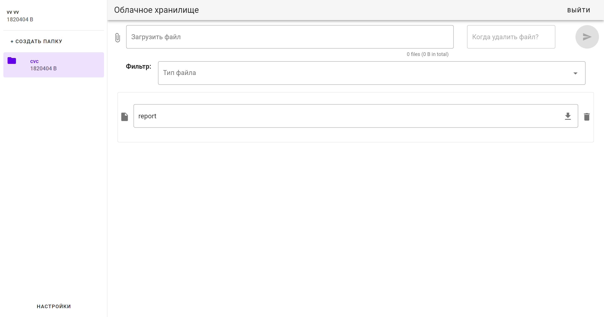
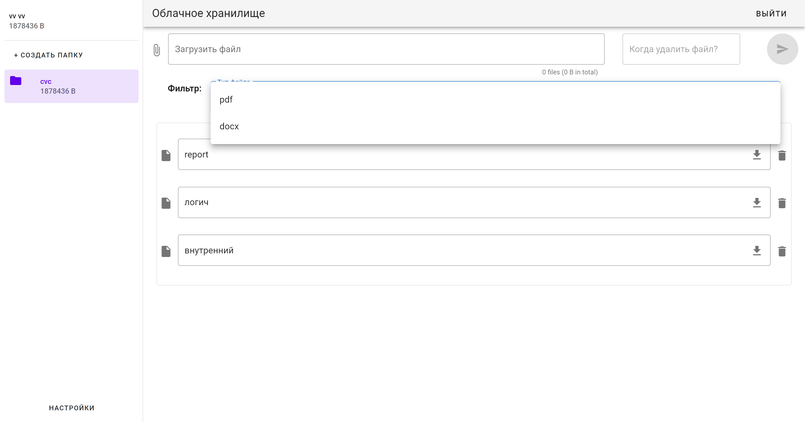
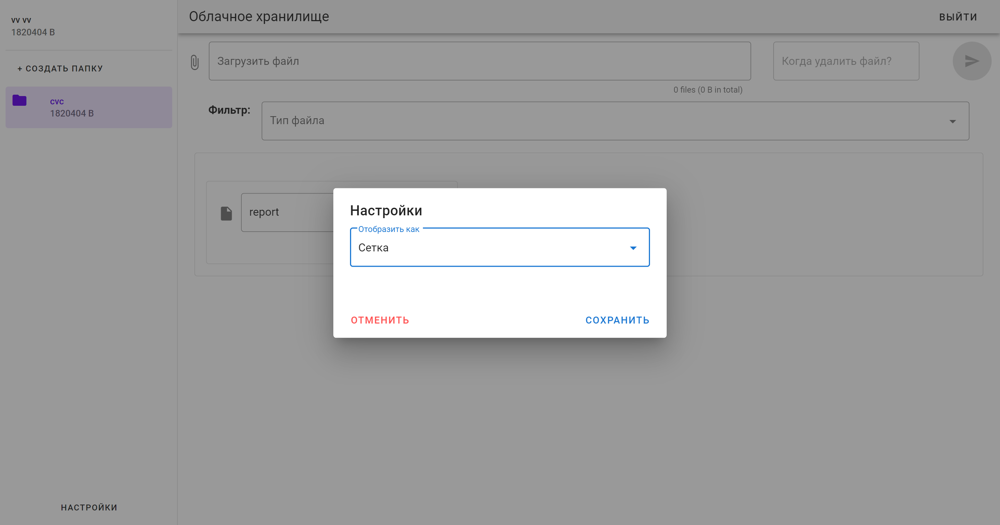

# Руководство пользователя

Ссылка на приложение: https://divnvp.github.io/cloud-storage-client/

## Авторизация / регистрация

При первом открытии приложения пользователь попадает на страницу авторизации. Если логина и пароля
у него ещё нет, следует нажать на кнопку "Регистрация". В противном случае - "Войти в хранилище". Если
пользователь ввёл неверные логин и пароль или попытался зарегистрироваться под логином, который уже
существует в системе, появится плашка предупреждения.

### Создание новой папки

После авторизации в хранилище можно приступать к работе. Для создания папки необходимо
нажать "+ Создать папку" в меню слева. Появится диалоговое окно создания. Остаётся только ввести название
и нажать "Создать". Если папка с таким же названием уже существует в системе, появится плашка
предупреждения.

### Загрузка нового файла

Выбрав папку, можно загрузить в неё файл с помощью поля "Загрузить файл". Следует нажать на него
и выбрать любой файл (кроме .php), после чего можно выбрать дату, когда файл будет удалён (поле можно оставить пустым).
Выполнив все необходимые действия, следует нажать на кнопку справа от файла.
**Если файл не появился в списке, обновите страницу!**.

## Работа с файлами

Чтобы **скачать** файл, необходимо нажать на иконку загрузки внутри текстового поля с файлом.
Чтобы **удалить** файл, необходимо нажать на иконку удаления за текстовым полем с файлом.
Чтобы **переименовать** файл, необходимо просто изменить его название в текстовом поле.

Чтобы отфильтровать файлы по типу, необходимо воспользоваться полем **Фильтр** и выбрать интересующий
формат файлов.

## Настройки отображения

Для того, чтобы изменить способ отображения файлов, необходимо воспользоваться кнопкой "Настройки"
внизу левого меню. Есть два способа отображения: сетка и таблица. После сохранения настроек,
они также сохранятся на устройстве пользователя.

